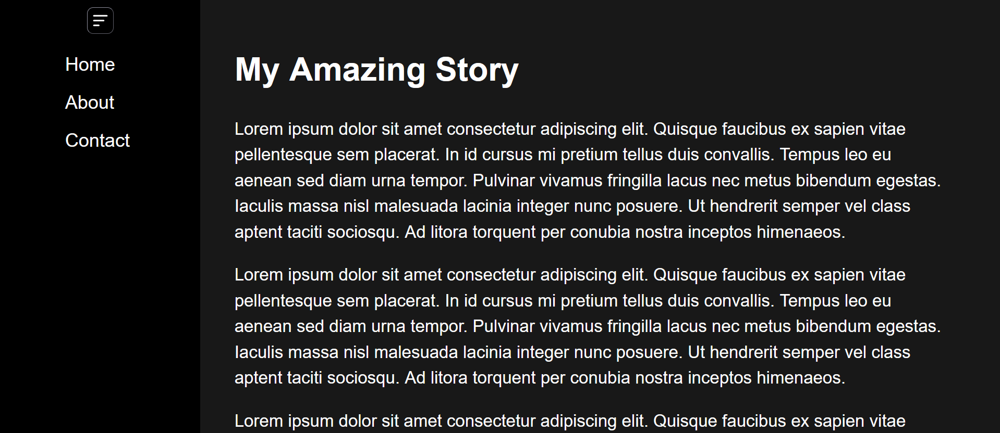
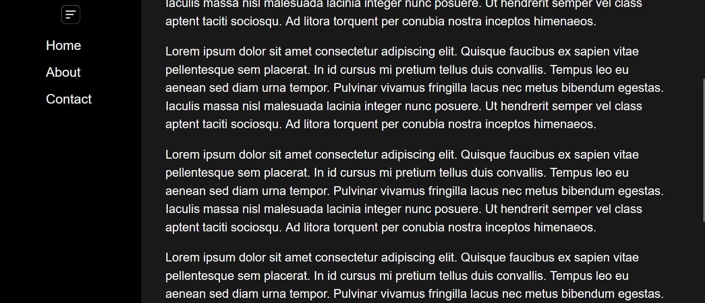
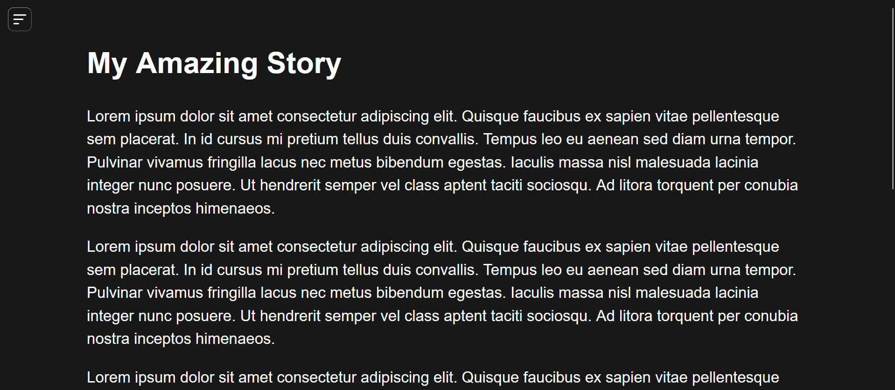
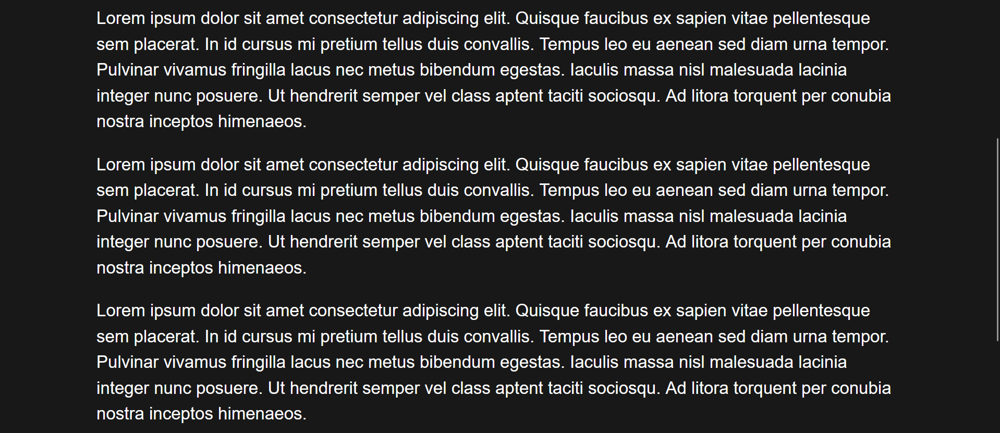
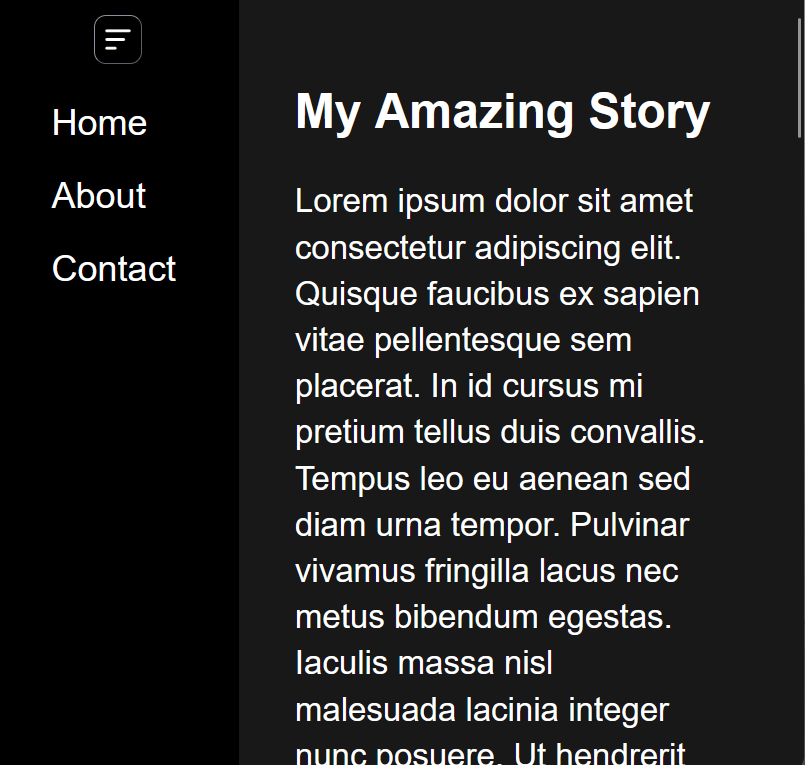
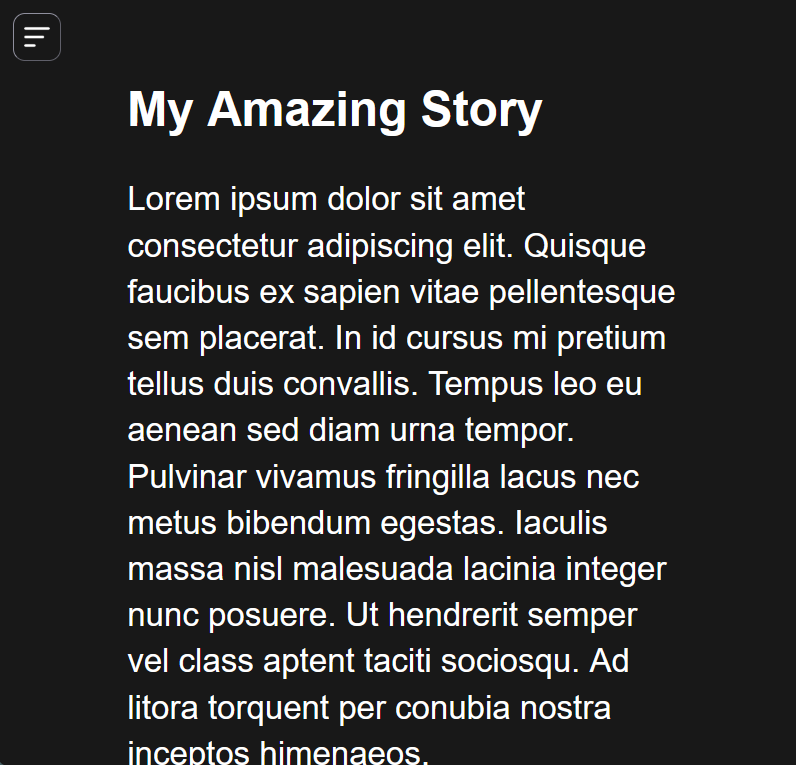
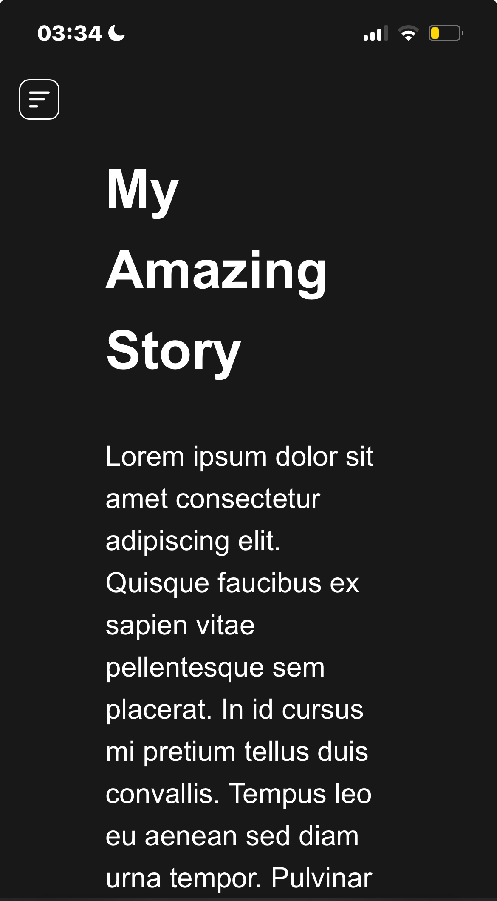
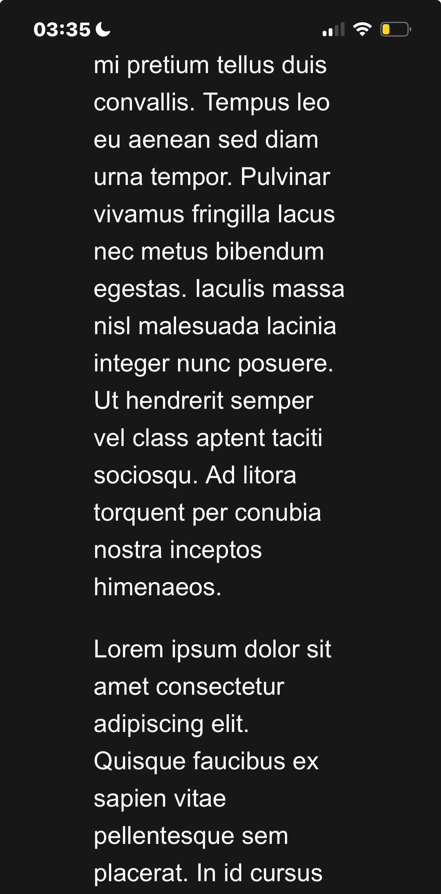

# Sidebar

A little HTML/CSS/JS project in which I have attempted (and succeeded, as far as I can tell) to implement a sidebar in a mobile-friendly manner.

## How it looks and works

On desktop/tablet the sidebar opens by default on page load.

On mobile the sidebar is closed by default on page load.

### Desktop

Here is the page on desktop with the sidebar open.

Here is what it looks like when you scroll down. As you see, the sidebar is fixed, so only the content scrolls.

Here is what it looks like when you close the sidebar on desktop.

Here is what it looks like when you scroll down with the sidebar closed on desktop. Notice that the toggle button stays at the top when the sidebar is closed.

### Tablet

Here is what it might look like on a tablet (I don't own one) with the sidebar open.

Here is what it might look like on a tablet with the sidebar closed.

The scrolled-down behaviour is the same for the tablet mode.

### Mobile

Here is how it looks like on mobile with the sidebar closed (the default).

Here is how it looks like on mobile with the sidebar closed and the page scrolled down. It behaves as on desktop/tablet.

Here is how it looks like on mobile with the sidebar open.

*~Marc Reed*